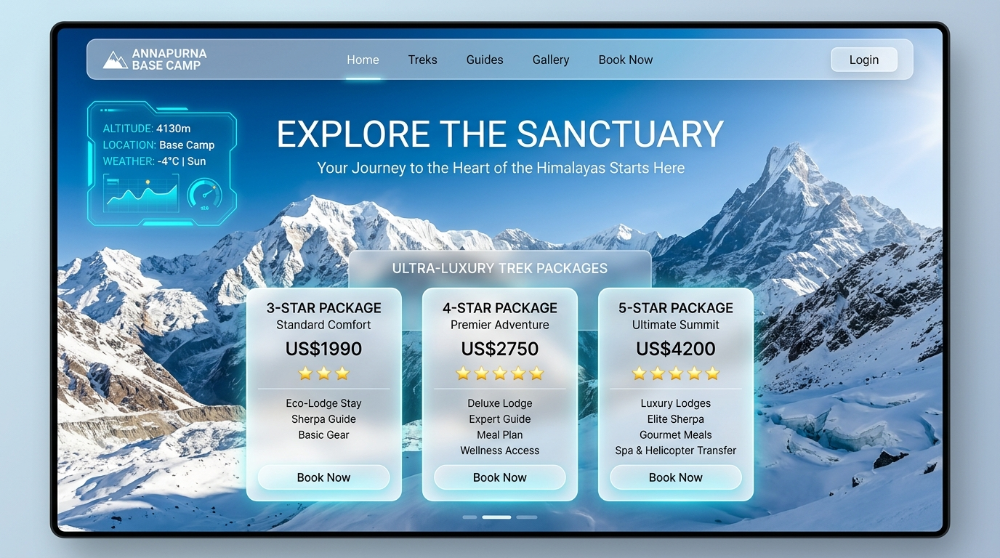

# Annapurnabasecamp.org 🏔️⚡

> Official High-Altitude Trekking Guidance & Luxury Booking Portal for Annapurna Base Camp (4,130m / 13,550ft), Nepal Himalayas.



---

## ❄️ Features & Architecture

- **Cyber-Alpine Futuristic White Theme**: Cohesive Glacier White aesthetic (`#F8FAFD`) with frosted aerogel glassmorphism (`rgba(255, 255, 255, 0.92)`), cyan HUD brackets, and high-contrast typography.
- **Scroll-Linked Telemetry HUD**: Real-time altitude, oxygen saturation percentage, GPS coordinates, and waypoint tracking synchronized to user scroll position.
- **Three Verified Service Tiers**:
  - ★ **3-Star Alpine Explorer**: Authentic stone teahouse lodges with 1:2 shared porter ratio.
  - ★★ **4-Star Mountain Premier**: Deluxe boutique lodges with private 1:1 dedicated porter.
  - ★★★ **5-Star Himalayan Sanctuary Luxury**: Luxury stone chalet suites with direct VIP Airbus H125 helicopter descent.
- **Dynamic Expedition Customizer**: Live quote calculator for group sizes, currencies (USD & NPR), helicopter returns, gear rentals, and satellite devices.
- **Supabase Cloud Backend (`abc_org` Schema)**:
  - Managed PostgreSQL relational database with Row Level Security (RLS) for guest bookings.
  - Encrypted Supabase Storage for ACAP permit passport scans & medical evacuation travel insurance.
  - Serverless Deno Edge Functions for tamper-proof Stripe price calculations and Resend voucher dispatch.
- **Expedition Safety Protocols**: Wilderness Medical Society AMS guidelines and interactive packing checklist with live duffel weight gauge.

---

## 🚀 Quick Start

### 1. Install Dependencies
```bash
npm install
```

### 2. Environment Configuration
Duplicate `.env.example` to `.env.local`:
```env
VITE_SUPABASE_URL=https://your-project.supabase.co
VITE_SUPABASE_ANON_KEY=your-anon-key
```

### 3. Run Development Server
```bash
npm run dev
```

### 4. Build for Production
```bash
npm run build
```
Output static assets will be compiled to the `dist/` directory, ready for direct deployment to S3, Cloudflare Pages, Vercel, or Netlify.

---

## 📄 License & ACAP Compliance
Protected under the Annapurna Conservation Area Project (ACAP) ethical trekking code. Official permit pre-allocation guaranteed.
